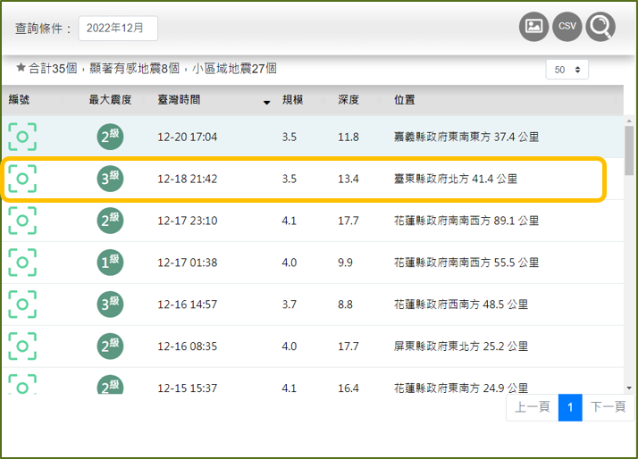
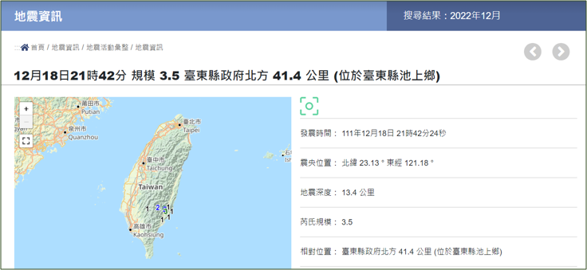

# 地震資料爬蟲與地圖標記系統
自動化爬取中央氣象署地震測報中心的地震資料，並將結果標記於互動地圖上。
## 網站來源：[中央氣象署地震測報中心](https://scweb.cwa.gov.tw/zh-tw/earthquake/data/)

## 功能概述
- 地震資料爬取：使用 BeautifulSoup 和 Selenium 爬取最新的地震資訊，包括時間、震央位置、規模與深度等。
- 台灣邊界劃分：使用 全國縣市界圖 json 檔劃分行政區域，更直覺呈現地震所在位置。
- 動態地圖標記：使用 folium 繪製台灣地圖，標記地震發生位置，並可點擊查看詳細資訊。
- 可視化強化：根據地震規模變更標記顏色與大小，以直觀呈現影響程度。

## 使用技術與套件
- 爬蟲技術：BeautifulSoup、Selenium
- 數據處理：Pandas
- 地圖繪製：folium
  

## 動態地圖呈現
 

